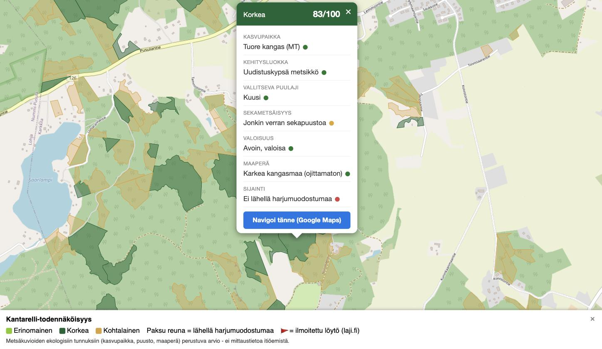

# Karkkila kantarelli map

A map of Karkkila, Finland that highlights the forest areas most likely
to grow chanterelles (*Cantharellus cibarius*, kantarelli) — built from
real forest inventory data, not guesswork, and usable straight from your
phone in the woods.

**Live map: [kantarelli.juhawilppu.com](https://kantarelli.juhawilppu.com)**



## What it does

Chanterelles are picky about where they grow: they partner mycorrhizally
mostly with spruce, favour mesic to herb-rich heath forest, mid-aged to
mature stands with enough light for moss to carpet the floor, well-drained
soil, and often turn up near eskers. Those aren't vibes — they're
attributes that Finland's forest inventories actually record per stand.

This project pulls that data for every one of Karkkila's ~13,000 forest
stands, scores each one against those habitat correlates, ranks them
against each other (since most of Karkkila is decent spruce forest, a
fixed score cutoff would flag nearly everything as "good" — relative
ranking is what actually points you somewhere useful), and renders the
result as an interactive map. Click any stand for its score and the
forestry data behind it. Open it on your phone and it'll track your live
location on the map too, refreshed every 30 seconds.

It's a habitat-suitability heuristic, not a model verified against actual
chanterelle sightings — treat it as "worth checking," not a guarantee.
And a reminder: mushroom picking is covered by *jokamiehenoikeus*
(everyman's right) everywhere shown, regardless of who owns the land.

## Data sources

- [Suomen metsäkeskus](https://www.metsakeskus.fi/fi/avoin-metsa-ja-luontotieto) —
  open forest resource data (metsävarakuviot): species, age, development
  class, site fertility, soil type, drainage state.
- [GTK](https://www.gtk.fi/) (Geological Survey of Finland) — glaciofluvial
  and moraine formation polygons (eskers), via ArcGIS REST.

## Setup

Requires Python 3.11+ (the system Python on macOS is usually too old for
current geopandas).

```
python3 -m venv .venv
source .venv/bin/activate
pip install -r requirements.txt
```

## Usage

```
python scripts/download_data.py   # downloads + caches source data under data/
python scripts/build_map.py       # scores stands, writes output/
```

Open `output/karkkila_kantarelli_map.html` directly in a browser.

To target a different municipality, change `MUNICIPALITY` at the top of
both scripts and rerun.
